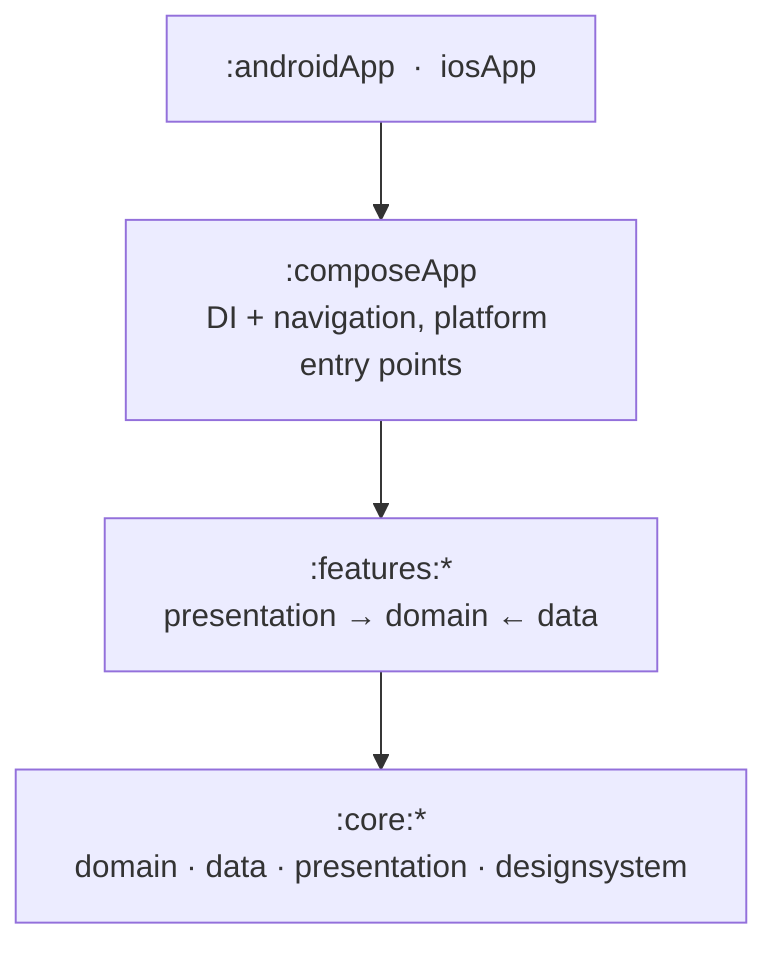

<p align="center">
  
</p>

<h1 align="center">TabMates</h1>

<p align="center">
  Split shared expenses with friends, flatmates and travel groups —<br>
  one Kotlin codebase running on <b>Android, iOS, Desktop and Web</b>.
</p>

<p align="center">
  <a href="https://app.tabmates.de"><b>▶&nbsp;&nbsp;Try it in your browser — app.tabmates.de</b></a>
</p>

<p align="center">
  
  
  
  
</p>

TabMates is a Kotlin Multiplatform (KMP) + Compose Multiplatform (CMP) app for tracking who paid for what in a group and settling up. The UI, business logic and data layer are shared across all targets; only thin platform shells differ.

<p align="center">
  
  
  
  
  
</p>
<p align="center">
  
  
  
  
  
</p>

## Features

- **Groups** — create groups, invite members via share links, join by link.
- **Expenses** — add, edit and view expenses with flexible splitting and **multiple currencies per expense**.
- **Offline-first** — browse groups and expenses and keep working without a connection; changes sync once you're back online (local Room cache).
- **Settle up** — see balances and who owes whom.
- **Activity feed** — recent changes across your groups.
- **Accounts** — register, log in, continue as guest, email verification and password reset.
- **Push notifications** — group activity via Firebase Cloud Messaging (Android/iOS), a WebSocket-driven channel on Desktop, and the Firebase JS SDK on Web. See [`features/notifications/README.md`](features/notifications/README.md).
- **App updates** — update check against the backend with optional and forced update prompts.
- **Settings** — theme (light/dark/system), in-app language, notification toggle with permission handling, and an open-source licenses screen.

## Platforms

| Target | Shell |
|--------|-------|
| Android | `:androidApp` |
| iOS | `iosApp` (SwiftUI host) |
| Desktop (JVM) | `:composeApp` desktop entry |
| Web (WasmJS) | `:composeApp` web entry — installable, offline-capable PWA |

## Quick start

### Prerequisites

- JDK 17+
- Android Studio (latest stable) / IntelliJ IDEA
- Xcode (for iOS), on macOS

### Configuration

Build-time config is injected via BuildKonfig and **required** to build. Add these to a `local.properties` file in the repo root (git-ignored), or provide them as environment variables in CI:

```properties
API_KEY=your-api-key
BASE_URL_HTTP=https://your-backend.example.com
BASE_URL_PUBLIC=https://your-web-app.example.com
```

There is no separate websocket URL: it is derived from `BASE_URL_HTTP` by swapping the scheme
(`https` → `wss`, `http` → `ws`) and appending `/ws`.

`BASE_URL_PUBLIC` is the user-facing host for shareable links and deep links (App Links / web fallback), decoupled from the API host. For local dev, set it to your `BASE_URL_HTTP` value. See [`docs/WEB_DEPLOYMENT.md`](docs/WEB_DEPLOYMENT.md#deep-links--android-app-links).

Optional per-target overrides let every target run against a local backend (`http://localhost:8080`) at the same time — the Android emulator reaches the host via `10.0.2.2`, and the browser stays same-origin through the webpack dev proxy:

```properties
BASE_URL_HTTP_ANDROID=http://10.0.2.2:8080
BASE_URL_HTTP_WEB=http://localhost:8081
# Optional, web-only: Cloudflare Turnstile site key (a public identifier) for the invisible bot
# check on the auth endpoints. Unset = no widget/token; harmless until the backend enforces it.
TURNSTILE_SITE_KEY=your-site-key
# Optional, web-only: Firebase Web Push certificate (VAPID) key for FCM push notifications.
# Unset = no push token requested; see features/notifications/README.md.
FCM_VAPID_KEY=your-vapid-key
# Optional, native-only: per-release token for the backend's client-version gate. Release CI mints
# it from a secret this repo never contains; for local dev against a dev backend, mint it yourself:
#   printf 'desktop|0.0.24' | openssl dgst -sha256 -hmac dev-client-secret -binary \
#     | basenc --base64url | tr -d '='
# The platform and version must match the build you are running (see APP_VERSION), or the backend
# answers 426. Unset = no token; harmless until the backend enables the gate.
CLIENT_BUILD_TOKEN=your-build-token
```

The web dev server always proxies `/api` and `/ws` to the backend (`composeApp/webpack.config.d/proxy.js`) because the backend serves no CORS headers; the proxy target follows the active `BASE_URL_HTTP`, so switching it points the web dev build at that environment too.

Push notifications additionally need Firebase config — see [`features/notifications/README.md`](features/notifications/README.md). A dummy `androidApp/google-services.json` is committed so the project builds out of the box; replace it with a real one for working push.

### Run

```bash
# Android — install on a device/emulator (or just run :androidApp from the IDE)
./gradlew :androidApp:installDebug

# Desktop (JVM), hot-reload enabled
./gradlew :composeApp:hotRunDesktop

# Web (WasmJS) — dev server on http://localhost:8081 (8080 is the backend dev server)
./gradlew :composeApp:wasmJsBrowserDevelopmentRun
```

iOS: open `iosApp/iosApp.xcodeproj` in Xcode and run, or use the KMP/AndroidStudio run configuration.

### Build & test

```bash
./gradlew build          # build all targets
./gradlew check          # run tests + lint (ktlint)
./gradlew ktlintFormat   # auto-format
```

## Tech stack

- **Kotlin Multiplatform** + **Compose Multiplatform** UI
- **Clean Architecture** + **MVI/MVVM** presentation
- **Koin** (annotations + compiler) for dependency injection
- **Navigation 3** (type-safe routes)
- **Ktor** client (ContentNegotiation + WebSockets) for networking
- **Room** (KMP) for local persistence
- **kotlinx.serialization**, **KSafe** (encrypted storage), **BuildKonfig** (build-time config)
- **kmpnotifier** / Firebase for push, **AboutLibraries** for license attribution
- Gradle **convention plugins** in `build-logic`, version catalog in `gradle/libs.versions.toml`

## Architecture

The project is modularized **by feature and by layer**. Dependencies point inward: `presentation → domain ← data`, with `core` shared by all features.



- **`:core:domain`** — pure Kotlin: models, `Result<D, E>`, error types, logging.
- **`:core:data`** — shared networking (`HttpClientFactory`), encrypted storage (`SecureStore`), preferences.
- **`:core:presentation`** — shared UI utilities (`UiText`, `ObserveAsEvents`, navigation contracts).
- **`:core:designsystem`** — theme, tokens and reusable Compose components.
- **`:features:*`** — each feature split into `domain` (interfaces, models), `data` (implementations, DTOs, mappers), `presentation` (screens, ViewModels, routes), optional `database`/`testing`.
- **`:composeApp`** — shared entry point: wires navigation and DI, hosts Desktop/Web `main` and the iOS `MainViewController`.
- **`:androidApp`** — Android application shell.

```
composeApp/                 Shared app entry (DI + navigation), desktop & web main, iOS controller
androidApp/                 Android application
iosApp/                     iOS SwiftUI host (Xcode project)
core/
  data/  domain/  presentation/  designsystem/
features/
  appupdate/       data · domain
  authentication/  data · domain · presentation · testing
  notifications/   data · domain · testing
  tabgroup/        data · domain · presentation · database · sqliteWasmWorker
build-logic/                Gradle convention plugins
gradle/libs.versions.toml   Version catalog
```

See [`AGENTS.md`](AGENTS.md) for detailed conventions.

## Deploying the web app

Hosting the web (WasmJS) build in production has extra requirements: cross-origin isolation headers (COOP/COEP) for the OPFS-backed database, a Content-Security-Policy, and CORS / websocket-origin configuration on the backend. The GitHub Pages deploy workflow (`.github/workflows/deploy-web.yml`) handles the build and publishing. Everything is documented in [`docs/WEB_DEPLOYMENT.md`](docs/WEB_DEPLOYMENT.md).

## More docs

- [`AGENTS.md`](AGENTS.md) — architecture, patterns and conventions in depth
- [`docs/WEB_DEPLOYMENT.md`](docs/WEB_DEPLOYMENT.md) — web hosting, CSP, CORS, GitHub Pages
- [`features/notifications/README.md`](features/notifications/README.md) — push notification setup per platform

## License

Licensed under the **GNU General Public License v3.0**. See [`LICENSE`](LICENSE).
